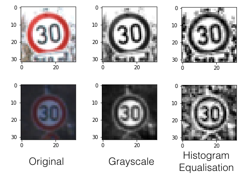
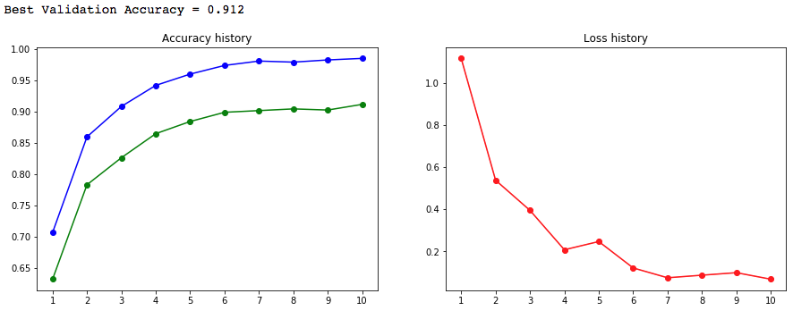
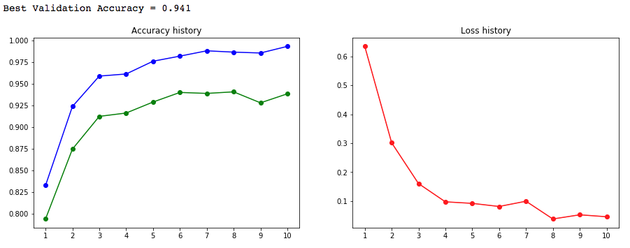
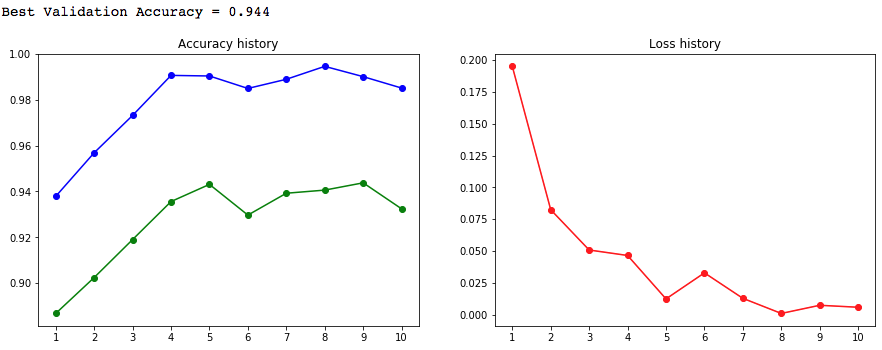
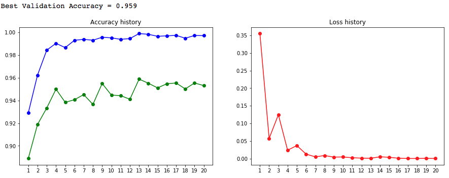
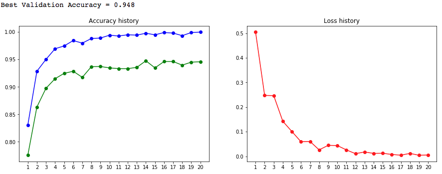
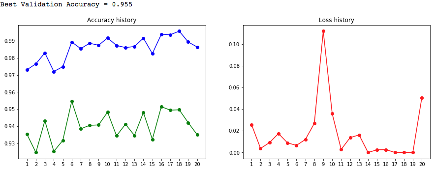
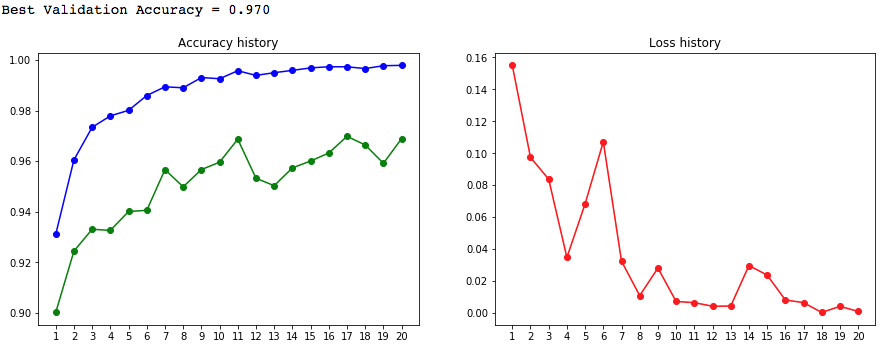
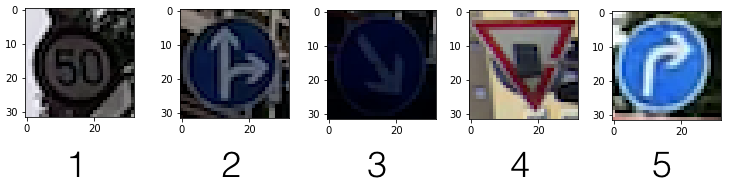
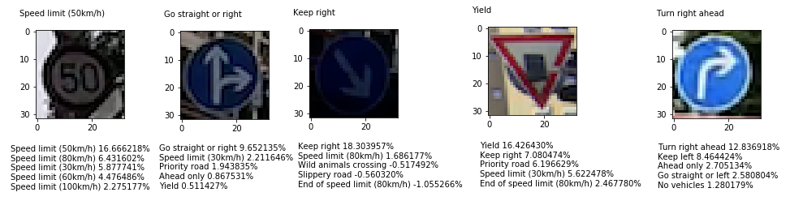

# **Traffic Sign Recognition** 

**Build a Traffic Sign Recognition Project**

The goals / steps of this project are the following:

* Load the data set (see below for links to the project data set)
* Explore, summarize and visualize the data set
* Design, train and test a model architecture
* Use the model to make predictions on new images
* Analyze the softmax probabilities of the new images
* Summarize the results with a written report

[//]: # (Image References)

[image1]: ./examples/visualization.jpg "Visualization"
[image2]: ./examples/grayscale.jpg "Grayscaling"
[image3]: ./examples/random_noise.jpg "Random Noise"
[image4]: ./examples/placeholder.png "Traffic Sign 1"
[image5]: ./examples/placeholder.png "Traffic Sign 2"
[image6]: ./examples/placeholder.png "Traffic Sign 3"
[image7]: ./examples/placeholder.png "Traffic Sign 4"
[image8]: ./examples/placeholder.png "Traffic Sign 5"

[sample0]: ./sample/0.png
[sample1]: ./sample/1.png
[sample2]: ./sample/2.png
[sample3]: ./sample/3.png
[sample4]: ./sample/4.png
[sample5]: ./sample/5.png
[sample6]: ./sample/6.png
[sample7]: ./sample/7.png
[sample8]: ./sample/8.png
[sample9]: ./sample/9.png
[sample10]: ./sample/10.png
[sample11]: ./sample/11.png
[sample12]: ./sample/12.png
[sample13]: ./sample/13.png
[sample14]: ./sample/14.png
[sample15]: ./sample/15.png
[sample16]: ./sample/16.png
[sample17]: ./sample/17.png
[sample18]: ./sample/18.png
[sample19]: ./sample/19.png

[count-train]: ./counts/train.png
[count-valid]: ./counts/valid.png
[count-test]: ./counts/test.png

---
### Data Set Summary & Exploration

#### 1. Summary of the data set. 

The number of examples in NumPy array can be calculated via len() function in Python, and the number of classes can be calculated via a combination of set() and len() functions. 

* Number of training examples = 34799
* Number of validation examples = 4410
* Number of testing examples = 12630
* Number of classes = 43

The "shape" of an example in input image datasets show us the size of the image is 32x32 and in colour (R,G,B).

* Image data shape = (32, 32, 3)

#### 2. Distribution of the dataset.

We counted occurrence of each y label in the example dataset. It show training data, validiation data, and test data has similar distribution for the labels.

![Counting of Training Set][count-train]
![Counting of Validation Set][count-valid]
![Counting of Test Set][count-test]

#### 3. Visualization of the dataset.

We can display given dataset with [matplot.pyplot](https://matplotlib.org/api/pyplot_api.html). The label also shown below the traffic sign.

![alt text][sample0]
![alt text][sample1]
![alt text][sample2]
![alt text][sample3]
![alt text][sample4]
![alt text][sample5]
![alt text][sample6]
![alt text][sample7]
![alt text][sample8]
![alt text][sample9]

### Design and Test a Model Architecture

#### 1. Start with Vanilla LeNet

As a first step, I start with LeNet topology in Lesson 9's Lab project.
Which has following layers:

| Layer         		|     Description	        					| 
|:---------------------:|:---------------------------------------------:| 
| Input         		| 32x32x1 Grayscale image   							| 
| Convolution 1	     	| 5x5 stride, valid padding, outputs 28x28x6 |
| Activation	| RELU|
| Max pooling	      	| 2x2 stride,  outputs 14x14x6 |
| Convolution 2	    | 5x5 stride, valid padding, outputs 10x10x16  |
| Activation| RELU |
| Max pooling	      	| 2x2 stride,  outputs 5x5x16 |
| Flatten				| Input: 5x5x16  Output: 400 |
| Fully Connected | 400 -> 120 |
| Activation	| RELU|
| Fully Connected | 120 -> 84 |
| Activation	| RELU|
| Fully Connected | 84 -> **43 (Number of classes)** |

The network is almost the same to LeNet which used to recognize digits. We only change the layer from 84 to 10 to 84 to 43 to match number of classes in the dataset.

#### 2. Image preprocess

##### Convert to Grayscale

The image in dataset is in 32x32x3 (RGB channel), we only need grayscale image for the input. 
We can find [formulae](https://en.wikipedia.org/wiki/YUV#Converting_between_Y%E2%80%B2UV_and_RGB) used to convert RGB encoding to YUV encoding. Y channel is the luminance we need for grayscale image.

*Y = 0.2989 * R + 0.5870 * R + 0.1140 * B*

##### Adaptive hisogram equalization

Then we try to apply [Contrast Limited Adaptive hisogram equalization](https://en.wikipedia.org/wiki/Adaptive_histogram_equalization#Contrast_Limited_AHE) to the image. This enhances the contrast of the image and also make different samples have similar brightness. According to the experiment result, this improve the validation accuracy.

*Accuracy without AHE*

*Accuracy with AHE*

#### 2. Play with training parameters

We play with serveral training parameters and record the accuacy and loss when training. Then we can have a history of accuracy during training. The blue lines shows accuracy on training set and green one shows validation set.

##### Epoches
We can get a good accuracy of 9x% with only 10 epoches, but it still improves a little after 10th epoch. So we start with 20, it helps us to observe the convergence.

*10 Epoches*

*20 Epoches*

##### Batch size
It seems smaller batch will converge faster than larger batch but not much. Large batch consumes more memory but will run a little faster, but we don't have much data and the time needed for training still acceptable. So we go with batch size of 64.

*Batch size: of 64*

*Batch size of 256*

#### Learning rate
The learning rate come with LeNet we got in the lesson is 0.001. We tried to make it larger and smaller. With a learn rate of 0.01, it seems too large for the gradient decent function, we can find it keep "missing" the local minimum and the accuracy is drifting. 

*Learning with LR of 0.01*

We also tried smaller learn rate of 0.0005, sometimes it find better weights than LR of 0.001. But the accuracy not improve much, so we decided keeping learn rate of 0.001 to following expreiments.

#### 3. Performance improve

With a topology almost the same to vanilla LeNet, we can have a accuracy about 91% and we can reach accuracy of 94 to 95% on the validation set with enhanced input sample. So we start to play with the network topology and write down the working approach. Network topology shown below:

##### Applying dropout
We can see the accuracy on training data is growing fast when training, we can have accuracy near 98% to 99% in epoch 4. But the accuracy on validation set is a little behind the training set, which indicated overfitting.
In the lesson we learned we can mitigate overfitting with dropouts. So we tried to apply dropout between convolutional layers and fully connect layers. After applying dropout, the accuracy on validation raised to about 97%.

| Layer         		|     Description	        					| 
|:---------------------:|:---------------------------------------------:| 
| Input         		| 32x32x1 Grayscale image   							| 
| Convolution 1	     	| 5x5 stride, valid padding, outputs 28x28x6 |
| Activation	| RELU|
| Max pooling	      	| 2x2 stride,  outputs 14x14x6 |
| Convolution 2	    | 5x5 stride, valid padding, outputs 10x10x16  |
| Activation| RELU |
| Max pooling	      	| 2x2 stride,  outputs 5x5x16 |
| Flatten				| Input: 5x5x16  Output: 400 |
|  ** Dropout **  |  ** Input/Output: 400, Keep rate: 0.6  **  |
| Fully Connected | 400 -> 120 |
| Activation	| RELU|
| Fully Connected | 120 -> 84 |
| Activation	| RELU|
| Fully Connected | 84 -> 43 (Number of classes) |

*Validation accuracy improved after applying dropout.*

##### Strategy of model saving
Since the accuracy on validation set goes up and down during training. If we save the model after all the epoches, we may not have the best one. So we compare the accuracy to the best accuracy we had so far in each epoches and only save the model when accuracy got improved.

### Test a Model on New Images

#### 1. Choose five German traffic signs found on the web and provide them in the report. For each image, discuss what quality or qualities might be difficult to classify.

Here are five German traffic signs that I found on the web:

They are crop from dashcam video clips I found on YouTube (link to original video can be found in description below). Which makes it more realstic to traffic sign camera installed on vehicles.

[#1](https://youtu.be/yNRqc2IaN5o?t=131) and [#3](https://youtu.be/yNRqc2IaN5o?t=531) captured in a cloudy day with a dashcam which is not good at low light enviornment. The images are so dark and that's why we think it will be more difficult to guess.

[#3](https://youtu.be/yNRqc2IaN5o?t=216) is a traffic sign which we have fewest samples in the training set. So we think it will be hard to guess. [#5](https://youtu.be/Tq-Xziv-8xY?t=8) has a nubmer of samples in median. We can see the effects on number of training samples.

In image [#4](https://youtu.be/0UKQ1yQb4_s?t=234), the traffic sign has been blocked by something. Let us see how the model works on this situation.

#### 2. Prediction results

Here are the results of the prediction with top 5 softmax probabilites. Lucky we got 100% right this time when we generating screenshots for this writeup. We can see the probability will be higher if we have more samples for a traffic sign.

